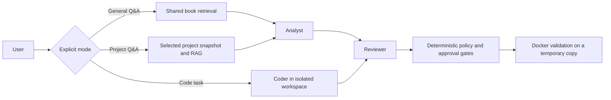

# Mini Agent Sandbox

Mini Agent Sandbox is a local-first, security-focused multi-agent system for
Kotlin and Android development. It combines local LLM roles, project-scoped
retrieval, persistent task state, deterministic policy checks, explicit human
approval, and Docker-isolated validation.

The project treats every LLM as an untrusted planner. A model may propose an
answer or patch, but it cannot grant itself permissions, approve its own patch,
change security policy, or turn a successful model call into proof that code is
correct.

> **Project status:** experimental and under active development. General Q&A
> and project Q&A work with local Ollama models. The security boundaries for
> behavioral evaluations, advisory regulation, and isolated execution are
> implemented and tested. Reviewer output remains model-generated and may miss
> technical details. A completed model call is not a correctness certificate.

## What it does

The CLI exposes three separate workflows:

1. **General question** — Analyst drafts an answer and Reviewer produces the
   final response. No project is selected and no filesystem tools are exposed.
   If the shared book library is available, both agents receive the same
   bounded technical excerpts.
2. **Project Q&A** — the user explicitly selects a registered project. The
   system retrieves evidence only from that project's saved snapshot and
   project-scoped RAG collection. It validates source paths and hashes before
   calling the agents.
3. **Code task** — Coder may write only inside its isolated workspace. Reviewer
   inspects the result, deterministic policy gates tool access, and trusted
   validation runs only in a restricted Docker environment.



General knowledge, project evidence, and generated task files use separate
storage paths. Selecting a project is explicit; a general question cannot
silently attach the sample GTA project.

## Security model

The main trust boundary is:

```text
untrusted LLM planner
        ↓
deterministic capability and path policy
        ↓
explicit user approval for the exact patch hash
        ↓
restricted tool capability
        ↓
Docker validation on a temporary workspace copy
        ↓
observable side effects and persisted evidence
```

Key properties:

- capabilities default to deny;
- agents have no general-purpose shell tool;
- project state and retrieval are isolated by project ID;
- project patches require an approved plan step, Reviewer decision, and
  explicit user approval bound to the patch SHA-256;
- the API does not control Docker;
- validation uses a non-root container with no network, dropped capabilities,
  a read-only root filesystem, and CPU, memory, process, and time limits;
- behavioral security evaluations inspect filesystem, state, facts, Vault,
  network, and tool-dispatch effects rather than model wording;
- Regulator proposals are advisory, contain evidence identifiers, and always
  use `auto_apply=false`.

See [Security Boundary Matrix](markdowns/SECURITY_BOUNDARY_MATRIX.md) for the
implemented boundaries and their evidence.

## Requirements

- Python **3.11**
- [Ollama](https://ollama.com/) for local completion and embeddings
- Docker Desktop or Docker Engine for isolated code validation
- Git

The default role configuration uses:

- `qwen2.5:14b` for agent completions;
- `nomic-embed-text` for ChromaDB embeddings.

Install the models before using the offline workflows:

```bash
ollama pull qwen2.5:14b
ollama pull nomic-embed-text
```

Model files and caches must remain outside the repository.

## Installation

Clone the repository and create a virtual environment:

```bash
git clone https://github.com/kharohiy/Mini-Agent-Sandbox.git
cd Mini-Agent-Sandbox
python -m venv .venv
```

Activate it on PowerShell:

```powershell
.\.venv\Scripts\Activate.ps1
```

Or in Git Bash on Windows:

```bash
source .venv/Scripts/activate
```

On Linux or macOS:

```bash
source .venv/bin/activate
```

Install the pinned dependencies:

```bash
python -m pip install --upgrade pip
python -m pip install -r requirements.txt
```

`requirements.txt` installs the runtime and development tools. Smaller
installations can use:

```bash
python -m pip install -r requirements-runtime.txt
```

PDF ingestion has a separate dependency set:

```bash
python -m pip install -r requirements-ingest.txt
```

## Run in offline mode

Offline mode fails closed if a completion route would leave local Ollama.

PowerShell:

```powershell
$env:MINI_AGENT_OFFLINE = "1"
python runner.py
```

Git Bash or Linux shell:

```bash
export MINI_AGENT_OFFLINE=1
python runner.py
```

The interactive menu is:

```text
1. Ask a question (no project)
2. Select a project and ask about it
3. Code task (allows workspace file changes)
0. Exit
```

Useful direct commands:

```bash
python runner.py --ask "Explain sealed classes in Kotlin"
python runner.py --project-qa
python runner.py --code local-user
python runner.py --resume local-user
python runner.py --reset local-user
```

`--reset` removes only that user's saved session state. It does not delete
facts, knowledge, RAG collections, Vault data, or registered projects.

The local completion timeout defaults to 600 seconds. Override it only when
needed:

```powershell
$env:MINI_AGENT_OLLAMA_TIMEOUT_SECONDS = "900"
```

Accepted values are 1–3600 seconds.

## Register and index a project

Registration creates an isolated metadata record and read-only snapshot. It
does not modify the connected source project.

```bash
python project_manager.py "E:\path\to\AndroidProject" \
  --name "My Android App" \
  --description "Local Android application"
```

The command prints the stable project ID. Build its project-scoped Chroma RAG
using that ID:

```bash
python -c "from project_rag_ingestion import ingest_project; print(ingest_project('project-id'))"
```

Then run:

```bash
python runner.py --project-qa
```

Select the project by number or ID. When asking about a specific file, use its
basename or project-relative path:

```text
In GtaSaViewModel.kt, how does toggleFavorite update the favorite state?
```

Quotes around a filename are not required. If multiple files share the same
basename, provide the relative path. An answer is based on the indexed snapshot,
so refresh the snapshot and RAG after the source project changes.

Project state is stored under:

```text
data/projects/<project-id>/
├── snapshot/
├── rag/
├── knowledge/
├── runs/
└── exports/
```

The connected project itself remains outside this directory and is treated as
read-only unless a separately approved patch workflow is used.

## Shared technical book library

General Q&A can use the global `android_architecture_library` collection. Add a
PDF explicitly with:

```bash
python ingest_knowledge.py --pdf "docs/Kotlin In Action.pdf"
```

The ingestion command converts the PDF to Markdown, creates bounded chunks,
embeds them through local `nomic-embed-text`, and stores them in:

```text
data/knowledge/global/chroma_db/
```

The book library is technical reference material. It is not project evidence,
does not modify a project snapshot, and is never treated as verified project
knowledge. Project Q&A does not include book excerpts by default.

## API

Start the loopback FastAPI service:

```bash
uvicorn api:app --host 127.0.0.1 --port 8000
```

Open the interactive API documentation at:

```text
http://127.0.0.1:8000/docs
```

The API exposes the security contract, registered project metadata, snapshots,
search, supplemental documents, verified knowledge cards, project policy,
retention previews, metrics, tasks, plans, patches, reviews, approvals, and
validation records. It records and authorizes workflows but does not receive a
Docker socket or execute validation containers.

The API can also run in a restricted container:

```bash
docker compose up --build api
```

The default Compose service does not mount local runtime state into the
container. Add an explicit deployment-specific data volume only after reviewing
its isolation and ownership requirements.

## Docker validation

Build the isolated Kotlin/Android executor image:

```bash
docker compose --profile build-executor build
```

The executor image contains JDK 17, Gradle 8.7, and Android API 35 tooling. The
trusted validation worker copies an approved workspace into a temporary area,
applies the approved diff there, and runs an allowlisted validation profile.
The original connected source tree is never mounted into the executor.

Do not run generated code or project Gradle builds directly on the Windows
host as part of the trusted validation workflow.

## Configuration

The main configuration files are:

| File | Purpose |
|---|---|
| `roles.json` | Agent models, prompts, temperatures, and project-Q&A routing |
| `capabilities.json` | Deny-by-default capabilities for planning and validated execution |
| `rules/repo_pattern.yaml` | Repository path and source rules |
| `data/settings.json` | Tracked RAG chunk-size defaults |
| `Dockerfile.executor` | Isolated Kotlin/Android validation image |
| `docker-compose.yml` | Restricted API and executor-image build profiles |

Runtime state, vector stores, telemetry, Vault files, model caches, and connected
project data are intentionally excluded from Git. Do not commit `data/`,
`.vault`, `.vault_key`, `.env`, or local model artifacts.

## Tests and checks

Run the deterministic test suite:

```bash
python -m unittest discover -s tests -t . -v
```

Run static checks:

```bash
python -m ruff check .
```

Run behavioral security evaluations:

```bash
python evals_pipeline.py
```

Installed-Ollama integration is opt-in and may invoke local models:

PowerShell:

```powershell
$env:MINI_AGENT_RUN_OFFLINE_INTEGRATION = "1"
python -m unittest tests.integration.local_ollama.test_offline_integration -v
```

Do not use that integration command for an ordinary deterministic test run.

## Repository layout

```text
runner.py                    CLI and agent orchestration
model_router.py              provider routing, offline policy, budgets
roles.json                   agent role configuration
api.py                       FastAPI workflow and knowledge API
capability_policy.py         deterministic capability authorization
data_guardrail.py            data and secret guardrails
project_registry.py          registered-project catalog
project_indexer.py           isolated source snapshot
project_rag_ingestion.py     project-scoped Chroma ingestion
project_retrieval.py         ordered, labelled project evidence
global_library_retrieval.py  shared technical-book retrieval
work_ledger.py               persistent plans, patches, reviews, runs
validation_worker.py         trusted approval and validation boundary
sandbox_executor.py          restricted Docker execution adapter
tests/                       deterministic and bounded integration tests
markdowns/                   canonical architecture and handover documents
```

## Current limitations

- Reviewer is another model role, not a compiler or formal verifier. Analyst
  and Reviewer can repeat the same mistake.
- Project evidence provenance is validated, but the system cannot prove that
  every generated explanation follows from that evidence.
- A code task blocked by the tool breaker may still leave the CLI process with
  exit code 0. Inspect persisted task status such as `breaker_blocked` or
  `validation_blocked`; process completion alone is not task success.
- Project registration uses an existing local checkout. Automatic remote clone,
  fetch, update, and credential management are not implemented.
- The system does not silently apply generated patches to connected source
  projects.

## Documentation

- [Architecture and runtime](markdowns/README.md)
- [Current handover and verified status](markdowns/CODEX_HANDOVER.md)
- [Next steps](markdowns/NEXT_STEPS_PLAN.md)
- [Evolution roadmap](markdowns/PROJECT_EVOLUTION_ROADMAP.md)
- [Test scenarios](markdowns/TESTS.md)
- [Offline acceptance evidence](markdowns/OFFLINE_ACCEPTANCE_20261002.md)
- [Project catalog and Q&A design](markdowns/TASK_PROJECT_CATALOG_AND_QA.md)
- [Security boundary matrix](markdowns/SECURITY_BOUNDARY_MATRIX.md)

When documentation disagrees, use the newest dated record in
`markdowns/CODEX_HANDOVER.md` and preserve recorded failed runs as evidence.
